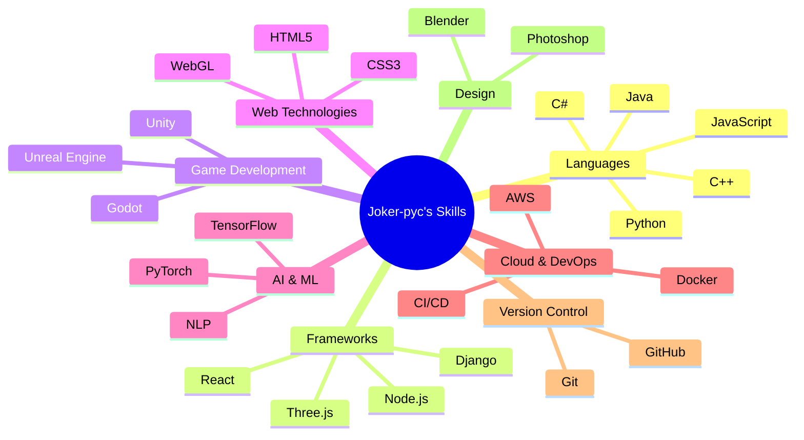

# 🎭 Joker-pyc | Digital Sorcerer & Game Dev Maestro

<div align="center">

[](https://github.com/Joker-pyc)
[](https://joker-pyc.github.io/Portfolio/)
[](https://www.linkedin.com/in/santosh-maurya-700630215/)
[](mailto:santoshmouriya1234567890@gmail.com)

</div>

---

## 🚀 Mission Control

Greetings, intrepid explorer of the digital frontier! You've stumbled upon the nexus of creativity and code, where pixels come alive and algorithms weave dreams. I'm Joker-pyc, a digital sorcerer and game dev virtuoso, crafting immersive realities and pushing the boundaries of what's possible in the digital realm.

---

## 🛠️ Arcane Arsenal: Skills & Technologies

<div align="center">



</div>

---

## 🎮 Game Development: Crafting Digital Realms

<div align="center">

```ascii
 /\__/\  /-----\  /\___/\
(= ಠωಠ=) | CODE |  (=^.^=)
 )   (   \-----/   )   (
(__ __)           (__V__)
   ∪      GAMES     ∪
```

In the realm of game development, I am both architect and alchemist. With a palette of programming languages and a canvas of creativity, I conjure interactive experiences that challenge, inspire, and transport players to worlds beyond imagination.

</div>

---

## 🌟 Upcoming Attractions

<div align="center">

```
🚀 Prepare for Launch: Groundbreaking Projects Incoming! 🚀

┏━━━━━━━━━━━━━━━━━━━━━━━━━━━━━━━━━━━━━━━━━━━━━━━━━━━━━━━━━━━━━━━━━┓
┃ 🕹️ Quantum Quests: A Reality-Bending Puzzle Platformer            ┃
┃ 🧠 NeuralNexus: AI-Powered Storytelling Engine                    ┃
┃ 🌐 CryptoCanvas: Blockchain-Based Collaborative Art Marketplace   ┃
┗━━━━━━━━━━━━━━━━━━━━━━━━━━━━━━━━━━━━━━━━━━━━━━━━━━━━━━━━━━━━━━━━━┛
```

The digital constellations are aligning. Soon, a nova of innovation will illuminate the tech universe. Stay tuned for reveals that will redefine the art of the possible.

</div>

---

## 📊 GitHub Constellations

<div align="center">


</div>

---

## 🌱 Growth Mindset: Current Quests

<div align="center">

| 🧠 AI Mastery | ☁️ Cloud Conquest | 📱 Mobile Mastery |
|:-------------:|:-----------------:|:-----------------:|
| Delving into advanced neural networks and reinforcement learning | Architecting scalable, serverless solutions on AWS and Azure | Crafting cross-platform marvels with React Native and Flutter |

</div>

---

## 💡 Visionary Pursuits

<div align="center">

```ascii
     /\                                 /\
   /    \        INNOVATION           /    \
 /        \                         /        \
/          \─────────────────────/          \
     /\                                 /\
   /    \         CREATIVITY          /    \
 /        \                         /        \
/          \─────────────────────/          \
     /\                                 /\
   /    \       COLLABORATION         /    \
 /        \                         /        \
/          \─────────────────────/          \
```

- 🚀 Pioneering the fusion of AI and immersive gaming experiences
- 🔮 Exploring the frontiers of AR/VR in educational technology
- 🌐 Championing open-source initiatives that empower developers globally
- 📚 Riding the bleeding edge of emerging tech, from quantum computing to biotechnology

</div>

---

## 🤝 Join Forces: Let's Rewrite Reality!

<div align="center">

Are you ready to embark on a quest to reshape the digital landscape? Whether you're a fellow code wizard, a visionary designer, or a curious explorer, I'm excited to collaborate and create digital wonders that push the boundaries of possibility!

<a href="mailto:santoshmouriya1234567890@gmail.com">
  
</a>
<a href="https://www.linkedin.com/in/santosh-maurya-700630215/">
  
</a>
<a href="https://joker-pyc.github.io/Portfolio/">
  
</a>

</div>

---

<div align="center">

💞️ *Driven by an insatiable curiosity and a passion for pushing technological boundaries. 
Together, let's craft the future, one line of code at a time!*

</div>

<!---
Joker-pyc/Joker-pyc is a ✨ special ✨ repository because its `README.md` (this file) appears on your GitHub profile.
You can click the Preview link to take a look at your changes.
--->
