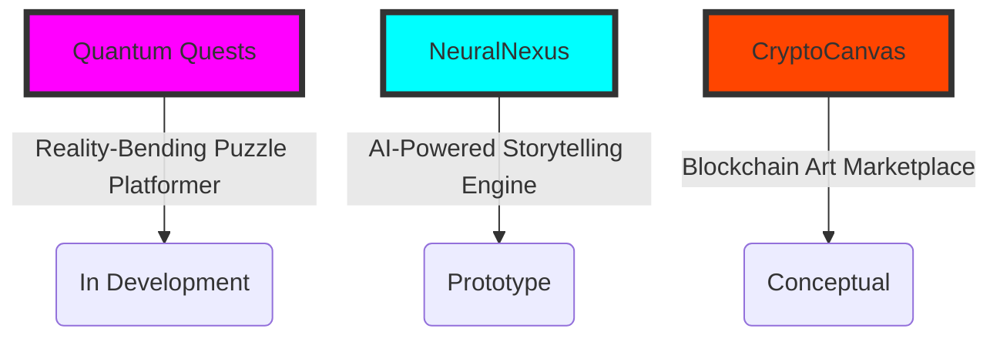

# 🌌 Joker-pyc | Digital Alchemist & Code Sorcerer

<div align="center">


[](https://github.com/Joker-pyc)
[](https://joker-pyc.github.io/Portfolio/)
[](https://www.linkedin.com/in/santosh-maurya-700630215/)
[](mailto:santoshmouriya1234567890@gmail.com)

</div>

---

## 🧬 Digital DNA: The Essence of Joker-pyc

```ascii
 ___________________
< Hacking Reality... >
 -------------------
        \   ^__^
         \  (oo)\_______
            (__)\       )\/\
                ||----w |
                ||     ||
```

Greetings, denizen of the digital realm! You've interfaced with the nexus of innovation and imagination. I am Joker-pyc, a techno-mage weaving the fabric of reality with lines of code. My mission: to push the boundaries of the possible and craft immersive digital experiences that challenge perceptions and ignite minds.

---

## 🔮 Tech Arsenal: Weapons of Mass Creation

<div align="center">

| 🧠 AI & ML | 🎮 Game Dev | 🌐 Web Tech | ☁️ Cloud & DevOps |
|:----------:|:----------:|:----------:|:-----------------:|
| TensorFlow | Unity | React | AWS |
| PyTorch | Unreal Engine | Three.js | Docker |
| NLP | Godot | Node.js | CI/CD |

| 🐍 Languages | 🎨 Design | 🔧 Tools |
|:------------:|:---------:|:--------:|
| Python | Photoshop | Git |
| JavaScript | Blender | GitHub |
| C# / C++ | Figma | VS Code |

</div>

---

## 🚀 Quantum Projects: Bending Reality

<div align="center">



</div>

The digital constellations are aligning. Prepare for a nova of innovation that will illuminate the tech universe. These projects are set to redefine the art of the possible.

---

## 📊 Code Cosmology: GitHub Metrics

<div align="center">


</div>

---

## 🌠 Neural Network: Current Upgrades

<div align="center">

| 🧠 Singularity Studies | 🌐 Quantum Web | 🚀 Nanotech Integration |
|:----------------------:|:--------------:|:------------------------:|
| Exploring the frontiers of AGI | Developing quantum-resistant cryptography | Merging biotech with digital interfaces |

</div>

---

## 💡 Visionary Vectors

```ascii
     /\                 /\                 /\
   /    \    INVENT   /    \   CREATE    /    \
 /        \         /        \         /        \
/   DREAM   \     /  BUILD    \     /  INSPIRE   \
```

- 🔬 Pioneering the fusion of consciousness and code
- 🌍 Architecting virtual worlds that transcend reality
- 🚀 Spearheading the next evolution of human-AI symbiosis
- 🧬 Decoding the universe's source code, one commit at a time

---

## 🤖 Initiate Neural Handshake

<div align="center">

Ready to rewrite the matrix? Whether you're a fellow code conjurer, a visionary dreamweaver, or a curious explorer of the digital frontier, I'm primed for collaboration. Let's forge digital wonders that defy the limits of imagination!

<a href="mailto:santoshmouriya1234567890@gmail.com">
  
</a>
<a href="https://www.linkedin.com/in/santosh-maurya-700630215/">
  
</a>
<a href="https://joker-pyc.github.io/Portfolio/">
  
</a>

</div>

---

<div align="center">

*In the symphony of zeros and ones, we are the composers of tomorrow. 
Together, let's orchestrate a future where technology and humanity dance in perfect harmony.*

</div>
