```mermaid
graph TD
    A[Joker-pyc's Skills] --> B[Languages]
    A --> C[Frameworks]
    A --> D[Game Development]
    A --> E[Web Technologies]
    A --> F[AI & ML]
    A --> G[Cloud & DevOps]
    A --> H[Version Control]
    A --> I[Design]

    B --> B1[Python]
    B --> B2[JavaScript]
    B --> B3[Java]
    B --> B4[C#]
    B --> B5[C++]

    C --> C1[React]
    C --> C2[Three.js]
    C --> C3[Node.js]
    C --> C4[Django]

    D --> D1[Unity]
    D --> D2[Unreal Engine]
    D --> D3[Godot]

    E --> E1[HTML5]
    E --> E2[CSS3]
    E --> E3[WebGL]

    F --> F1[TensorFlow]
    F --> F2[PyTorch]
    F --> F3[NLP]

    G --> G1[AWS]
    G --> G2[Docker]
    G --> G3[CI/CD]

    H --> H1[Git]
    H --> H2[GitHub]

    I --> I1[Photoshop]
    I --> I2[Blender]

    classDef default fill:#8E44AD,stroke:#fff,stroke-width:2px,color:#fff,font-weight:bold;
    classDef section fill:#5B2C6F,stroke:#fff,stroke-width:2px,color:#fff,font-weight:bold;
    class A,B,C,D,E,F,G,H,I section;
```

# 🎭 Joker-pyc | Digital Sorcerer & Game Dev Maestro

<div align="center">

[](https://github.com/Joker-pyc)
[](https://joker-pyc.github.io/Portfolio/)
[](https://www.linkedin.com/in/santosh-maurya-700630215/)
[](mailto:santoshmouriya1234567890@gmail.com)

</div>

---

## 🚀 Mission Control

Greetings, fellow digital explorer! Welcome to the nexus of creativity and code, where pixels come alive and algorithms weave dreams. I'm Joker-pyc, a digital sorcerer and game development virtuoso, dedicated to crafting immersive realities and pushing the boundaries of what's possible in the digital realm.

---

## 🛠️ Arcane Arsenal: Skills & Technologies

<div align="center">



</div>

---

## 🎮 Game Development: Crafting Digital Realms

In the realm of game development, I am both architect and alchemist. With a palette of programming languages and a canvas of creativity, I conjure interactive experiences that challenge, inspire, and transport players to worlds beyond imagination.

<div align="center">

| Unity | Unreal Engine | Godot |
|:-----:|:-------------:|:-----:|
|  |  |  |

</div>

---

## 🌟 Upcoming Attractions

<div align="center">

```
🚀 Prepare for Launch: Groundbreaking Projects Incoming! 🚀

┏━━━━━━━━━━━━━━━━━━━━━━━━━━━━━━━━━━━━━━━━━━━━━━━━━━━━━━━━━━━━━━━━━┓
┃ 🕹️ Quantum Quests: A Reality-Bending Puzzle Platformer            ┃
┃ 🧠 NeuralNexus: AI-Powered Storytelling Engine                    ┃
┃ 🌐 CryptoCanvas: Blockchain-Based Collaborative Art Marketplace   ┃
┗━━━━━━━━━━━━━━━━━━━━━━━━━━━━━━━━━━━━━━━━━━━━━━━━━━━━━━━━━━━━━━━━━┛
```

The digital constellations are aligning. Soon, a nova of innovation will illuminate the tech universe. Stay tuned for reveals that will redefine the art of the possible.

</div>

---

## 📊 GitHub Constellations

<div align="center">


</div>

---

## 🌱 Growth Mindset: Current Quests

<div align="center">

| 🧠 AI Mastery | ☁️ Cloud Conquest | 📱 Mobile Mastery |
|:-------------:|:-----------------:|:-----------------:|
| Delving into advanced neural networks and reinforcement learning | Architecting scalable, serverless solutions on AWS and Azure | Crafting cross-platform marvels with React Native and Flutter |

</div>

---

## 💡 Visionary Pursuits

- 🚀 Pioneering the fusion of AI and immersive gaming experiences
- 🔮 Exploring the frontiers of AR/VR in educational technology
- 🌐 Championing open-source initiatives that empower developers globally
- 📚 Riding the bleeding edge of emerging tech, from quantum computing to biotechnology

---

## 🤝 Join Forces: Let's Rewrite Reality!

<div align="center">

Are you ready to embark on a quest to reshape the digital landscape? Whether you're a fellow code wizard, a visionary designer, or a curious explorer, I'm excited to collaborate and create digital wonders that push the boundaries of possibility!

<a href="mailto:santoshmouriya1234567890@gmail.com">
  
</a>
<a href="https://www.linkedin.com/in/santosh-maurya-700630215/">
  
</a>
<a href="https://joker-pyc.github.io/Portfolio/">
  
</a>

</div>

---

<div align="center">

💞️ *Driven by an insatiable curiosity and a passion for pushing technological boundaries. 
Together, let's craft the future, one line of code at a time!*

</div>
