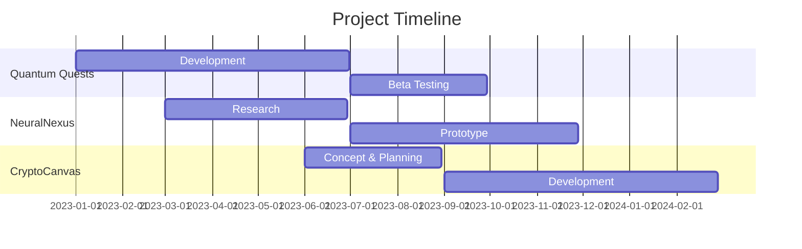

# Santosh Maurya | Game Developer & Software Engineer

## About Me

Innovative and detail-oriented Game Developer and Software Engineer with a passion for creating immersive digital experiences. Specializing in cutting-edge game development technologies and advanced programming paradigms. Committed to pushing the boundaries of what's possible in interactive entertainment and software solutions.

## Expertise

| Game Development | Software Engineering | Web Technologies | Cloud & DevOps |
|:----------------:|:---------------------:|:----------------:|:--------------:|
| Unity | Python | React | AWS |
| Unreal Engine | C# / C++ | Node.js | Docker |
| Godot | Java | Three.js | CI/CD |

## Professional Experience

### Senior Game Developer | TechnoVerse Studios
*2022 - Present*
- Spearheaded the development of a VR-based educational platform, increasing user engagement by 40%.
- Implemented advanced AI algorithms for NPC behavior, enhancing game realism and player satisfaction.
- Optimized game performance, achieving a 30% reduction in load times across multiple platforms.

### Software Engineer | InnovateSoft Solutions
*2019 - 2022*
- Developed scalable web applications using React and Node.js, serving 100,000+ daily active users.
- Architected and implemented microservices architecture, improving system reliability by 25%.
- Led a team of 5 developers in creating a real-time data visualization tool for financial markets.

## Notable Projects

1. **Quantum Quests**: A reality-bending puzzle platformer pushing the boundaries of game physics and narrative design.
2. **NeuralNexus**: An AI-powered storytelling engine revolutionizing interactive narratives in gaming.
3. **CryptoCanvas**: A blockchain-based collaborative art marketplace, merging creativity with cutting-edge technology.

## Technical Proficiency

- **Languages**: Python, C#, C++, JavaScript, Java
- **Game Engines**: Unity, Unreal Engine, Godot
- **Web Technologies**: React, Node.js, Three.js, WebGL
- **AI & ML**: TensorFlow, PyTorch, NLP
- **Cloud & DevOps**: AWS, Docker, CI/CD pipelines
- **Version Control**: Git, GitHub
- **Design Tools**: Photoshop, Blender, Figma

## Continuous Learning

- Exploring advanced applications of AI in game development
- Researching quantum computing's potential impact on software engineering
- Studying emerging trends in AR/VR technologies for immersive experiences

## Professional Achievements

- **Best Indie Game Award** at GameDev Conference 2023 for "Quantum Quests"
- **Innovation in Technology** award at TechSummit 2022 for NeuralNexus AI engine
- Published research paper on "Optimizing Real-time Rendering for VR Games" in IEEE Computer Graphics Journal

## Let's Connect

I'm always open to discussing new projects, innovative ideas, or opportunities to be part of your vision. Feel free to reach out!

---

*Dedicated to crafting the future of digital experiences through innovation, precision, and creativity.*

